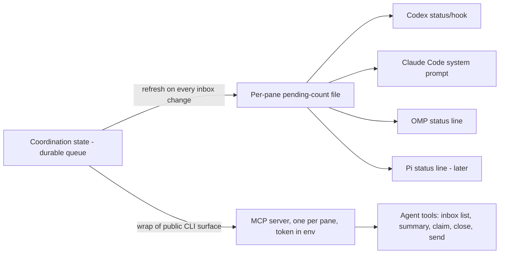

# Requirements: Agent-facing MCP surface for Interlock coordination

## Summary

Ship an MCP server that gives any agent — Codex, Claude Code, OMP — a read/write surface for its Interlock pane: list the inbox, claim and close messages, send replies, and check a pending count. Pair it with a machine-readable pending-count status file the coordination layer keeps fresh, so every host can surface a lightweight "N pending" nudge. Pull-first delivery: agents check at natural breakpoints; the urgent flag stays the only interrupt.

---

## Problem Frame

The org keeps bumping agents to deliver messages, and the bumping hurts. Agents get interrupted mid-work by pushed prompts, messages go unanswered because digest nudges get ignored, and agents outside Pi (Codex, Claude Code, OMP sessions) have no way to see their Interlock queue at all — they learn about a message only when a human or Pi agent relays it.

The queue itself is not the gap. Interlock already stores pane-scoped messages with a durable lifecycle (`queued → claimed → handled → closed`) behind a tested CLI, and the Pi extension already exposes `space_inbox`. What is missing is the agent-facing surface — non-Pi agents cannot reach the queue — and a trigger model that neither interrupts work nor silently drops requests.

The current default is push: bump the agent with the message. Push is the only trigger agents act on, so the org uses it for everything, and active work gets derailed. The fix is to make pull trustworthy: every agent type gets a first-class tool surface, plus a cheap always-current signal that makes "check your inbox at the next break" a habit instead of a suggestion.

---

## Key Decisions

- **MCP server, not CLI-only or Pi-only tools.** Agents do not reliably shell out, and the Pi extension only reaches Pi agents. MCP is the one tool protocol every target host (Codex, Claude Code, OMP) supports natively; one implementation covers them all.
- **Wrap the coordination CLI rather than reimplement against the engine internals.** The Herdr adapter already proves this pattern (thin translation to the public command surface) and the tests treat that surface as the contract. One authority for validation, token auth, stage transitions, and errors.
- **Hybrid trigger: pull-first with a status-file nudge.** Pure push interrupts work; pure pull loses messages to agent inattention. The count-only status file gives every host a cheap signal without injecting message content into a live turn.
- **The coordination layer owns writing the status file.** Freshness requires refreshing on every inbox change (delivery, claim, close). Agent-side or server-call-side writes go stale the moment an agent stops checking — which is exactly the moment the nudge is needed.
- **Per-pane identity via the pane token in the environment.** One MCP server instance serves one pane, authenticating with the existing `INTERLOCK_PANE_TOKEN` path. This matches the documented bearer-token threat model: tokens live in the environment, never in files, configs, or message text.
- **Count-only status file.** Message content stays in the durable queue already covered by the plaintext-state disclosure; the nudge adds no new content surface.

---

## Actors

- A1. **Agent session** — a Codex, Claude Code, or OMP run acting as an Interlock pane; reads its inbox, claims and closes messages, sends replies, and checks its pending count.
- A2. **Host** — the agent's runtime (Codex, Claude Code, OMP; later Pi): launches the MCP server with the pane token and optionally surfaces the pending count.
- A3. **Interlock coordination engine** — owns message state, token authentication, stage transitions, and the pending-count file.
- A4. **Sending pane** — another agent or manager whose message lands in the recipient pane's queue.

---

## Requirements

**MCP surface**

- R1. The MCP server exposes a tool listing pending messages (queued and claimed) addressed to its pane, with sender, text, thread/reply correlation, and stage.
- R2. The MCP server exposes a tool returning the pane's pending count and digest summaries, without full message bodies.
- R3. The MCP server exposes a tool claiming one queued message for the pane, using the existing message-stage transition rules.
- R4. The MCP server exposes a tool closing one message the pane owns, using the existing terminal-stage rules.
- R5. The MCP server exposes a tool sending a message from the pane, with optional reply-to message id and channel id, following the existing send authorization rules (same pod; leader channel for cross-pod).
- R6. Every tool authenticates as the pane from the server's environment token; callers pass no token per call. Calls with a missing or invalid token fail with a clear error and no state change.
- R7. Tool behavior is the existing coordination CLI behavior exactly — same validation, same errors, same state transitions — reached through the same public surface the Herdr adapter uses.
- R8. One server implementation works unchanged on every stdio MCP host verified in v1: Codex, Claude Code, and OMP.

**Pending-count nudge**

- R9. The coordination layer maintains a per-pane pending-count record at a known path under the state directory, covering each pane with a registered identity.
- R10. The record refreshes whenever that pane's inbox changes — delivery, claim, close, and any later inbox-mutating operation — so the count is accurate without the recipient asking.
- R11. The record contains only counts and timestamps (for example pending, oldest-pending age); never message content, sender names, or topics.
- R12. A host can read the record and surface it (status line, system prompt, hook) without running the MCP server and without MCP support.

**Trigger model**

- R13. Message delivery defaults to quiet queueing: the recipient's pending count updates and no agent is interrupted.
- R14. The urgent flag remains the only interrupt path and keeps today's behavior unchanged.

**Access boundary**

- R15. v1 covers the messaging loop only: inbox list, summary, claim, close, send. Task, session, pod, orchestrator, and dashboard operations stay CLI-only; the server does not expose them.

---

## Key Flows

- F1. Message arrives quietly
  - **Trigger:** A4 sends a message to A1's pane.
  - **Actors:** A3, A4
  - **Steps:** Engine queues the message; engine refreshes the pane's pending-count record; no interrupt fires.
  - **Outcome:** A1's count is 1; the message waits in the queue.
  - **Covered by:** R10, R11, R13
- F2. Pull, claim, and reply at a breakpoint
  - **Trigger:** A1 finishes a unit of work and sees the nudge.
  - **Actors:** A1, A2, A3
  - **Steps:** A1 calls the summary/inbox tool → claims the message → works or composes a reply → sends with reply-to correlation → closes the message when terminal; the count refreshes at each step.
  - **Outcome:** Request answered with no bump at any point; queue shows handled/closed.
  - **Covered by:** R1–R7, R10
- F3. Host surfaces the nudge
  - **Trigger:** Host polls or reads the pending-count record.
  - **Actors:** A2
  - **Steps:** Host reads the record → shows "3 pending" in its status surface → agent checks its inbox at the next natural break.
  - **Outcome:** The agent learns something waits without having message content injected mid-turn.
  - **Covered by:** R9, R12

---

## Acceptance Examples

- AE1. **Covers R1, R10, R13.** Given a pane with zero pending messages, when another pane sends it a message, then its pending count becomes 1 and no interrupt reaches the pane.
- AE2. **Covers R3, R10.** Given a message queued for the pane, when the agent claims it, then the message stage moves to claimed and the pending count still counts it — claimed is not done.
- AE3. **Covers R6.** Given the server started with a missing or invalid pane token, when any tool is invoked, then the call returns an authentication error and no state change occurs.
- AE4. **Covers R5, R7.** Given the agent claimed message #42, when it replies with reply-to #42, then the message is delivered with thread correlation and behavior identical to the CLI's `send --reply 42`.
- AE5. **Covers R11.** Given the pending-count record on disk, when a host reads it, then it contains only counts and timestamps — no message text, senders, or topics.
- AE6. **Covers R14.** Given a send marked urgent, then interrupt behavior matches today's urgent path exactly — unchanged by this work.
- AE7. **Covers R8.** Given the Codex `[mcp_servers.*]` wiring pattern, when the same server config is used on Claude Code and OMP, then all tools behave identically.

---

## Success Criteria

- A Codex agent completes the full loop with no human bump: message arrives → nudge shows the pending count → agent lists, claims, replies, and closes → count returns to zero.
- The same server build passes the loop on Codex, Claude Code, and OMP without host-specific changes.
- Every tool call maps 1:1 to an existing CLI command behavior — no new coordination state rules are introduced.
- Existing coordination tests stay green; the server adds tests, not exceptions.

---

## Scope Boundaries

**Deferred for later**

- Task tools (`task list/claim/stage/progress`) — natural next slice once the messaging loop is proven.
- Session state tools (`session set idle/busy/done`).
- Pod, orchestrator, channel, awareness, and dashboard tools — operator and human surfaces today.
- Pi extension switching its nudge to the status file (separate repo; it already has `space_inbox`).
- MCP native notifications replacing the status file — host support is too uneven to rely on.
- Token provisioning automation — stays with the existing orchestrator/vault flow.

**Outside this product's identity**

- Hosted or multi-machine delivery — Interlock remains local, same-user.
- Any surface that injects message content into a live agent turn as the default — pull-first is the posture.

---

## Dependencies / Assumptions

- Codex supports stdio MCP servers — verified on this machine via existing `[mcp_servers.*]` entries in `~/.codex/config.toml`, including per-tool approval modes.
- Claude Code and OMP support stdio MCP servers per the same protocol — standard capability; verify during planning if wiring surprises appear.
- Each participating agent has its pane token provisioned through the existing flow (orchestrator `pod create`, vault-backed storage). Provisioning itself is unchanged by this work.
- Agents already share `$INTERLOCK_STATE_DIR`; the status file rides the same plaintext-state disclosure already documented in the README threat model.
- The urgent delivery path exists today as described; its exact current mechanics were not re-verified in this scan (unverified assumption — confirm in planning).

---

## Outstanding Questions

**Deferred to Planning**

- Exact path, filename, and JSON shape of the pending-count record; align with the existing `deliveries/<pane>/` convention.
- Which code paths count as inbox changes that refresh the count (send, claim, close, reap, compact) and where the refresh is called.
- Packaging: separate `packages/interlock-mcp` (mirroring `packages/interlock-plugin-herdr`) versus a bin of the engine package.
- How the existing `watch`/digest loop relates to the count file (shares refresh points; must not double-write or drift).
- Whether the summary tool returns digest references in addition to counts.
- Host wiring documentation for Codex, Claude Code, and OMP (token env plumbing per host).

---

## Sources / Research

- `src/coordination/commands.ts` — full CLI surface; `inbox claim/close` lifecycle and the `--token` / `INTERLOCK_PANE_TOKEN` authentication path.
- `packages/interlock-plugin-herdr/src/index.ts` and `packages/interlock-plugin-herdr/test/space-adapter.test.ts` — the wrap-the-CLI adapter pattern and its test style to mirror.
- `src/coordination/host-adapter.ts` — ADR-0002 boundary: the engine exposes contracts; hosts own implementations.
- `README.md` "Security and threat model" — bearer-token rules, plaintext state at rest, first-registration squatting; direct constraints on the token path and the count-only file.
- `~/projects/herdr-space-manager/pi-extension/index.ts` — existing Pi tools and the pull-model protocol text the MCP description should align with.
- `~/.codex/config.toml` — confirmed `[mcp_servers.<name>]` stdio wiring with per-tool `approval_mode`.
- `docs/adr/0002-host-adapter-boundary.md` — adapter-boundary precedent for a new host-facing package.
