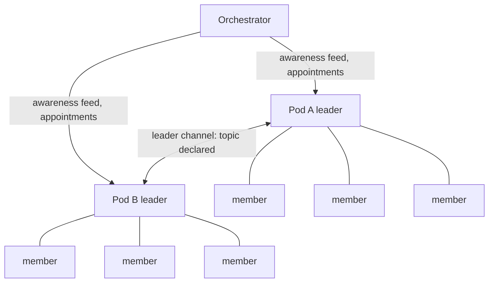

# Pods Model - Plan

## Goal Capsule

- **Objective:** Give the interlock engine a host-agnostic group primitive — the pod — with an enforced communication boundary, leader channels, a thin orchestrator entity, and death-verified succession, shipped in v0.0.1 together with the herdr plugin.
- **Product authority:** CEO decisions of 2026-08-17, recorded as session-settled Key Decisions below. Head office (space wN) relays amendments.
- **Open blockers:** BB IDE plugin surface documentation (needed for v0.0.2 planning only, input owed by CEO).

## Product Contract

### Summary

Pods become the engine's group primitive: a named effort with a roster of members, free communication inside the pod, and no communication outside it except through one leader who does no engineering work. Leaders of different pods open direct topic-carrying channels, while a thin orchestrator entity receives an awareness feed — who is talking to whom, about what — never the content. Pods self-heal a verified-dead leader by automatic promotion and never close on their own. v0.0.1 ships this model with the boundary enforced and the herdr plugin included; BB IDE arrives in v0.0.2 as an adapter only.

### Problem Frame

Multi-agent setups today run flat: any agent can message any agent, and coordination discipline lives in convention, not mechanism. Our own space network proves the cost — the charter's manager-only external communication rule works because managers choose to follow it, and the W380 adversarial review showed what happens when identity and routing rest on convention: forgery, squatting, and dead-holder wedges. The community users we will ship to will not have our charter. They need the topology enforced by the engine itself. At the same time, interlock must not hard-wire herdr's worldview — herdr is the first host, not the only one, and a second host (BB IDE) is already scheduled.

### Key Decisions

- **Pods ship in v0.0.1 with the boundary enforced** (session-settled: user-directed — chosen over flat-messaging-first release: the boundary is a security invariant; retrofitting it onto a released flat API forces a breaking v0.0.2). Governs R18.
- **Leader channels with awareness-only orchestrator visibility** (session-settled: user-directed — chosen over strict hub routing: mirrors how real leadership teams work; the orchestrator sees the meeting, not the minutes). Governs R8, R11, R12.
- **The orchestrator is a thin engine entity** (session-settled: user-approved — chosen over host-level wiring: a hard requirement needs engine enforcement, and a host that forgets to wire oversight fails open). Governs R10.
- **The engine vocabulary is "member"** (session-settled: user-directed — chosen over agent/seat: pane stays herdr's word; "agent" collides with the process, and the identity outlives processes). Governs R4.
- **Template-created pods with creation-time succession and death-only auto-promotion** (session-settled: user-directed — chosen over orchestrator-assigned succession and staleness heuristics: a busy leader must never trigger promotion; only provable death may). Governs R1, R2, R13, R14, R16.
- **Pods never close automatically** (session-settled: user-directed — pods only get shut down when we shut them down). Governs R15.
- **Exclusive membership** (session-settled: user-directed — chosen over multi-pod membership: a member in two pods is a person-shaped hole in the boundary). Governs R3.
- **Only the orchestrator creates pods and appoints leaders** — closes first-registration squatting by construction, the same hole QA found for pane names. Governs R5.

### Actors

- A1. **Member (worker)** — an engine identity inside exactly one pod, doing engineering work, reachable only within its pod.
- A2. **Pod leader** — the single member per pod with external reach; performs no engineering work; orchestrates inter-pod needs and speaks for the pod.
- A3. **Orchestrator** — the one engine entity that creates pods, appoints leaders and successors after done-events, receives the awareness feed, and closes pods deliberately.
- A4. **Host adapter** — herdr plugin or BB IDE plugin; translates native concepts (herdr space and pane, BB IDE agent thread) into pods and members without engine changes.

### Requirements

**Pod structure and membership**

- R1. The engine must provide pods as named groups of members working on one focused effort, created from a template that defines the roster, the leader, and the ranked succession order at creation time.
- R2. The default template must define one leader and three workers, and smaller pods must be legal — the template is a default, not a floor.
- R3. A member must belong to exactly one pod at a time.
- R4. The engine must name its identity primitive "member"; hosts map their native identities to members.
- R5. Only the orchestrator can create pods, appoint the leader, and define the succession order.

**Communication boundary**

- R6. A non-leader member must be able to send messages only to members of its own pod, including its leader.
- R7. The leader must be the only member able to communicate outside the pod, and the leader role performs no engineering work.
- R8. A leader must be able to open a direct channel to another pod's leader, and every channel must carry a declared topic at open time.
- R9. The engine must enforce the boundary by mechanism — token-checked routing that rejects violations — never by convention.

**Orchestrator and awareness**

- R10. The engine must define exactly one orchestrator entity per deployment, addressable by rule, able to message any pod leader.
- R11. The awareness feed must record, without message content: leader channel opened (participants, topic), channel closed (message count), leader verified-death and promotion, leader done, pod created, pod closed.
- R12. The orchestrator must never receive leader-channel message content.

**Succession and lifecycle**

- R13. Auto-promotion must fire only on engine-verified leader death — the leader's process ID is gone, or the ID was recycled with a different start time — and never on silence, staleness, or missed heartbeats alone.
- R14. A leader reporting done must not trigger auto-promotion; it must fire an awareness event, after which the orchestrator appoints a successor or closes the pod.
- R15. A pod must never close automatically, including when every member is done; only a deliberate orchestrator action closes a pod.
- R16. Succession must follow the ranked order defined at pod creation; pods hold no elections.

**Host-agnosticism and release**

- R17. The pod schema must contain no host-specific fields; a host that does not exist today must be adoptable with zero schema changes (the third-host test).
- R18. v0.0.1 must ship pods with the boundary enforced plus the herdr plugin; no flat-messaging release may precede it.
- R19. The v0.0.2 BB IDE support must land as an adapter only, requiring no engine changes — this is the executable proof of R17.
- R20. The herdr plugin must map pod to herdr space and member to initialized pane, and must install only after detecting herdr and receiving explicit user permission.

### Key Flows

- F1. Create a pod
  - **Trigger:** Orchestrator initiates a pod from a template.
  - **Actors:** A3, A1, A2.
  - **Steps:** Orchestrator names the pod, sets the roster, appoints the leader, fixes the succession order; members register and receive pod-scoped tokens.
  - **Covers R1, R2, R5.**
- F2. Intra-pod message
  - **Trigger:** A member sends to another member of the same pod.
  - **Steps:** Engine verifies both memberships; message delivers. A send addressed outside the pod is rejected.
  - **Covers R6, R9.**
- F3. Leader channel
  - **Trigger:** Leader of pod A needs coordination with pod B.
  - **Steps:** Leader A opens a channel to leader B with a declared topic; the awareness feed records the open; the leaders exchange messages directly; close records the message count.
  - **Covers R8, R11, R12.**
- F4. Leader death
  - **Trigger:** The engine verifies the leader's death (process gone or recycled).
  - **Steps:** The next member in the succession order is promoted automatically; the awareness feed records death and promotion; the pod's external reach is restored.
  - **Covers R13, R16.**
- F5. Leader done
  - **Trigger:** The leader reports done.
  - **Steps:** An awareness event fires; no promotion occurs; the orchestrator appoints a successor from the roster or closes the pod.
  - **Covers R14.**
- F6. Close a pod
  - **Trigger:** Deliberate orchestrator decision only.
  - **Steps:** Orchestrator closes the pod; the awareness feed records the closure; the record persists as history.
  - **Covers R15.**

### Acceptance Examples

- AE1. **Given** a leader whose process is alive and busy but silent for two hours, **when** the engine evaluates succession, **then** no promotion fires. **Covers R13.**
- AE2. **Given** a leader whose process ID now belongs to a different process (start-time mismatch), **when** the engine evaluates succession, **then** the next ranked member is promoted. **Covers R13, R16.**
- AE3. **Given** a leader that reports done while the pod's effort continues, **when** the report lands, **then** an awareness event fires and the pod waits for the orchestrator with no promotion. **Covers R14.**
- AE4. **Given** a worker that attempts to send to the orchestrator or to another pod's member, **when** routing evaluates the send, **then** the engine rejects it. **Covers R6, R9.**
- AE5. **Given** a pod whose every member has reported done, **when** time passes with no orchestrator action, **then** the pod remains open. **Covers R15.**
- AE6. **Given** a leader opening a channel without a topic, **when** the open is attempted, **then** the engine rejects it. **Covers R8.**

### Success Criteria

- The third-host test is demonstrable in documentation: a walkthrough shows a hypothetical new host adopting pods with zero schema changes.
- The security suite includes forgery cases for the boundary and for succession: forged leader token, forged death signal, worker attempting external send.
- From the awareness feed alone, the orchestrator can reconstruct who talked to whom and about what, across a deployment.

### Scope Boundaries

**Deferred for later**

- BB IDE adapter — v0.0.2, pending the plugin surface documentation (OQ1).

**Outside this product's identity**

- Orchestrator visibility into leader-channel content — awareness only, by explicit decision.
- Automatic pod closure under any condition.

### Dependencies / Assumptions

- Process-identity verification (process ID plus start time) exists from the lease slice of W380 and must generalize to members; if it does not, R13 blocks.
- The digest mechanism exists in the merged plane; the awareness feed is a new trigger on it, not new machinery.
- Threat model remains local, same-user coordination; the community release README must disclose it (plaintext state at rest, registration trust assumptions).
- DevOps is creating the npm organization in parallel; packaging details are operational, not planning scope.

### Outstanding Questions

- OQ1. What is BB IDE's plugin surface — how plugins load, and what an agent thread exposes? **Deferred to Planning** (blocks v0.0.2 planning, not v0.0.1; input owed by CEO).
- OQ2. Awareness feed retention and storage format. **Deferred to Planning.**
- OQ3. Maximum pods per deployment and roster sizes beyond the default template. **Deferred to Planning.**

### Sources / Research

- `DIRECTIVE.md` — community release directive, 2026-08-17, including the host-agnostic pods amendment.
- `src/coordination/types.ts`, `src/coordination/commands.ts` — current plane inventory: sessions, tasks, messages, digests, dashboard; no group concept, no routing boundary.
- `../qa-w380-review.md` (head-office QA report) — must-fix lessons behind R9, R13, R15: forgery-by-convention, stale-vs-done reap guard, dead-holder wedge.
- `../CHARTER.md` — the space network's communication conventions this model mechanizes: managers communicate manager-to-manager, members through their manager, head office re-designates unresponsive managers.
- `herdr --skill` output — herdr's workspace/pane model used for the R20 mapping.

## How This Work Fits Together

<!-- ce-section: work-relationships -->

This plan owns the pods model and the v0.0.1 release shape. The broader breakdown is current understanding, not a committed roadmap:

- Community packaging (license, npm metadata, CI, disclosure README, publish dry-run) — depends on this plan's R18 release shape; can proceed in parallel as mechanical release work.
- v0.0.2 BB IDE adapter — depends on this plan (R17, R19) and on OQ1.
- The 15-item follow-up queue from the W380 review — can proceed independently of this plan.
