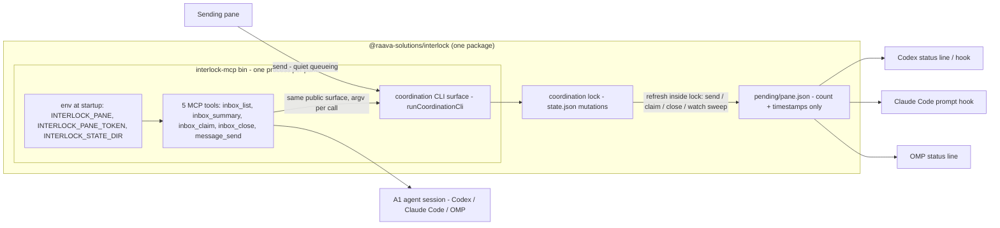

# Agent Inbox MCP - Plan

## Summary

Ship the agent-facing half of Interlock delivery: an MCP server that gives any stdio-MCP host (Codex, Claude Code, OMP) a read/write surface over its pane's inbox — list, summary/count, claim, close, send — plus a count-only per-pane pending-status file the coordination engine keeps fresh, so every host can surface a cheap "N pending" nudge without message content ever entering a live turn.

The problem is a trigger-model gap, not a queue gap. Messages are durable and lifecycle-tested behind the coordination CLI, but agents outside Pi cannot see their queue at all, so the org pushes (bumps) agents mid-work — the only trigger they act on. This plan makes pull trustworthy: a first-class tool surface for every host, and an always-current pending count that turns "check your inbox at the next break" into a habit. The design is deliberately conservative: the server is a thin wrapper over the same public CLI surface the herdr adapter already wraps (`runCoordinationCli`), so every tool call maps 1:1 to existing validated behavior and no new coordination state rules are introduced.

Honest posture on urgent (R14, AE6): the Interlock engine has **no urgent concept** — verified by search of `src/coordination/`. The interrupt path lives entirely in the herdr host transport (`space.js` in the separate herdr-space-manager repo prompts a pane directly only with `--urgent`). This plan touches neither. For Codex/Claude Code/OMP the status file is the only signal in v1; nothing in this work may introduce a new interrupt mechanism.

---

## Requirements

Carried from the origin doc (`docs/brainstorms/2026-08-29-agent-inbox-mcp-requirements.md`) with origin IDs; wording condensed, meaning preserved.

**MCP surface**

- R1. A tool lists pending messages (queued and claimed) addressed to the pane, with sender, text, thread/reply correlation, and stage.
- R2. A tool returns the pane's pending count and digest summaries, without full message bodies.
- R3. A tool claims one queued message for the pane, using existing message-stage transition rules.
- R4. A tool closes one message the pane owns, using existing terminal-stage rules.
- R5. A tool sends a message from the pane, with optional reply-to message id and channel id, following existing send authorization rules (same pod; leader channel for cross-pod).
- R6. Every tool authenticates as the pane from the server's environment token; callers pass no token per call. Missing or invalid token fails with a clear error and no state change.
- R7. Tool behavior is the existing coordination CLI behavior exactly — same validation, errors, and state transitions — reached through the same public surface the herdr adapter uses.
- R8. One server implementation works unchanged on every stdio MCP host verified in v1: Codex, Claude Code, and OMP.

**Pending-count nudge**

- R9. The coordination layer maintains a per-pane pending-count record at a known path under the state directory, covering each pane with a registered identity.
- R10. The record refreshes whenever that pane's inbox changes — delivery, claim, close, and any later inbox-mutating operation.
- R11. The record contains only counts and timestamps; never message content, sender names, or topics.
- R12. A host can read the record without running the MCP server and without MCP support.

**Trigger model**

- R13. Message delivery defaults to quiet queueing: the recipient's pending count updates and no agent is interrupted.
- R14. The urgent flag remains the only interrupt path and keeps today's behavior unchanged (see Summary: it lives in the herdr transport, not the engine; untouched here).

**Access boundary**

- R15. v1 covers the messaging loop only: inbox list, summary, claim, close, send. Task, session, pod, orchestrator, and dashboard operations stay CLI-only; the server does not expose them.

Origin actors (A1 agent session, A2 host, A3 coordination engine, A4 sending pane) and flows (F1 quiet arrival, F2 pull-claim-reply at a breakpoint, F3 host surfaces the nudge) carry unchanged into this plan; units below map to them.

---

## Key Technical Decisions

### KTD1 — Packaging: bundled bin inside the engine package

**Decision.** Ship the MCP server as a new bin, `interlock-mcp`, inside `@raava-solutions/interlock` (source in `src/mcp/`, compiled next to the existing `interlock` bin under `dist/src/mcp/`). No new package.

**Rationale.** The server is not a host adapter in the ADR-0002 sense: it implements no native-identity mapping, no `HostAdapter` contract, and holds no host-side state — it is a second front door onto the engine's own public CLI surface, importing nothing host-specific. The herdr plugin is a separate package because ADR-0002 forbids the engine from importing herdr code; no analogous boundary applies here, since `src/mcp/` imports only the engine's existing `./coordination` export (the dependency direction ADR-0002 requires — adapters import the engine, never the reverse — is satisfied). Bundling removes a second version to keep in lockstep (the exact drift class `interlock doctor` polices for the herdr plugin), and one `npm install -g @raava-solutions/interlock` gives a host both the CLI and the server — the whole artifact a host config needs is one command line.

**Alternative considered.** Separate `packages/interlock-mcp` mirroring `packages/interlock-plugin-herdr`. Rejected for v1: it buys isolation the server does not need and costs lockstep versioning. If the server ever grows host-specific state or its own release cadence, promote it then (see Scope Boundaries).

### KTD2 — Protocol: official `@modelcontextprotocol/sdk`, scoped to the server entry

**Decision.** Build the server on the official TypeScript MCP SDK, stdio transport. The dependency is imported only from `src/mcp/` — no module under `src/cli/` or `src/coordination/` may import it, so CLI and library consumers of the `.` and `./coordination` exports never load it.

**Rationale.** The repo is dependency-light (two runtime deps) and that is a value worth naming; this decision knowingly spends one dependency to buy it. The MCP handshake (initialize, capability negotiation, protocol-version negotiation, tool-result framing) is exactly the surface that breaks silently and differently per host — R8/AE7 demand identical behavior on three hosts, and a hand-rolled JSON-RPC 2.0 subset would put that requirement on our bespoke test coverage instead of the SDK's conformance to the spec. The failure mode of a framing bug is "tools work on Codex, vanish on OMP," which is expensive to diagnose from the host side.

**Alternative considered.** Hand-rolled minimal JSON-RPC over stdio (zero deps). Rejected: similar LOC budget spent on protocol tests, higher residual risk against R8.

### KTD3 — Status file: `$INTERLOCK_STATE_DIR/pending/<pane>.json`, counts and timestamps only

**Decision.** One JSON file per pane at `pending/<pane>.json` directly under the state directory, sibling to the existing `deliveries/<pane>/` convention (`coordinationDeliveryDir` in `src/coordination/state.ts`). Fields — exactly these, nothing else:

| field | meaning |
| --- | --- |
| `version` | record-format version, integer, starts at 1 |
| `pane` | the pane name (the record's subject, not message metadata) |
| `pending` | count of messages addressed to the pane in stage `queued` or `claimed` |
| `oldestPendingAt` | ISO timestamp of the oldest pending message's creation, or `null` when `pending` is 0 |
| `updatedAt` | ISO timestamp of this refresh |

No message ids, senders, threads, topics, or digest references (R11). A missing file means "no signal yet"; hosts treat it as zero and never fail on absence. Pane names are filesystem-safe by construction — `validateCoordinationName` in `src/coordination/validation.ts` restricts the charset to alphanumerics plus `:._-` and rejects `..` — so `<pane>.json` needs no escaping.

**Rationale.** Per-pane files mirror the deliveries convention and keep each file single-writer under the lock; a single aggregate file would make every refresh a read-modify-write over all panes' counts. `pending` counts `claimed` as pending because claimed is not done (AE2) — the recipient still owes the sender a close. Whether the summary *tool* (R2) carries digest references is answered in U2: it does, derived from the CLI's existing `--json` output — but they never enter this file, which stays the host-side nudge with the smallest possible content surface.

### KTD4 — Refresh points: inside `withCoordinationLock`, after the state change, converge-on-rewrite

**Decision.** Add one engine-internal helper (proposed `src/coordination/pending-status.ts`) that derives a pane's pending record from the in-memory state it is handed and writes it atomically (temp file + rename, the pattern `writeDigestDeliveryFile` establishes). Call sites — every one inside the existing `withCoordinationLock` critical section in `src/coordination/commands.ts`, after the mutation:

1. `sendCommand` — refresh the **recipient's** file (new queued message). Also refresh the **sender's** file when a reply moved the parent message from `queued`/`claimed` to `handled` (that send shrank the sender's pending set; the parent-handoff branch in `sendCommand` is the only inbox effect on the sender).
2. `inboxCommand` `claim` and `close` subcommands — refresh the acting pane's file.
3. `watchCommand --once` — refresh-all sweep: rewrite the file for every registered member (zero-count files included) from the freshly locked state. This satisfies R9's "covering each pane with a registered identity" and doubles as the repair path for a deleted or torn file, mirroring the digest-repair precedent inside `inboxCommand`.

Checked-and-excluded: `compactCommand` — `compactTerminalRecords` removes only `handled`/`closed` messages, which are never counted as pending, so a dedicated call site is unnecessary; the watch sweep converges anyway. Task reap — touches tasks, not messages. `sessionCommand` — session state never changes the message set (digest delivery suppresses re-delivery but does not move stages).

**Rationale.** Writing inside the lock is what makes the count honest: concurrent writers are already serialized there (the same property the il-yhw digest repair relies on), so a refresh can never observe or persist a torn intermediate, and status writes cannot race each other — they ride the same lock the state mutation does. Converge-on-rewrite (never increment/decrement) makes every refresh idempotent and self-healing: any drift from a crash between the state write and the status write is corrected by the next operation on that pane or the next sweep. The engine — not the server, not the agent — owns freshness because the nudge must stay accurate precisely when the agent has stopped looking (origin Key Decision).

### KTD5 — Error and startup edge behavior: start lenient, fail closed per call

**Decision.** At startup the server reads `INTERLOCK_PANE`, `INTERLOCK_PANE_TOKEN`, and `INTERLOCK_STATE_DIR` from the environment and **always starts**, even when identity is missing — a stdio MCP server that exits at boot produces a host-side "server failed to start" with poor ergonomics; a started server returns a clear per-call error naming the missing variable (AE3). The server performs no state creation and no token probe at startup: state-directory absence surfaces as the CLI's own clear error on first call, and probing the token at boot would race pod provisioning for a signal the first tool call provides anyway. Every tool call translates to argv carrying the startup-time pane; authentication and validation stay entirely with the engine (`requiredToken`'s `INTERLOCK_PANE_TOKEN` env fallback, `assertMemberToken`'s timing-safe hash check) — the server reimplements none of it. A missing/invalid token therefore fails before any mutation, inside the engine, and no status file is written because no lock section is entered.

**Rationale.** One authority for auth means AE3 holds for free: the engine's token check runs first in every wrapped command, and its `Error:` message passes through as the MCP tool error verbatim.

### KTD6 — Tool descriptions: agents route by description, so descriptions carry the protocol

**Decision.** Five tools, named after the CLI verbs so the mapping is visible: `inbox_list`, `inbox_summary`, `inbox_claim`, `inbox_close`, `message_send`. Each gets a one-to-two-sentence description following three rules:

- **State the trigger model.** `inbox_list` / `inbox_summary` descriptions tell the agent to check at natural breakpoints between units of work, and that quiet queueing is the norm — the pull-protocol posture the existing Pi extension tools already teach; wording should align with that text so agents learn one protocol, not two.
- **State the lifecycle.** `inbox_claim`: claim a `queued` message before working it; `inbox_close`: close only messages this pane received and finished; `message_send`: reply with the claimed message's id as the reply-to so the sender sees thread correlation.
- **Name failure in one clause.** E.g. claiming a message whose stage forbids it, or one not addressed to this pane, returns an error — re-list before retrying.

Keep descriptions short; the CLI's `coordinationUsage` phrasing is the tone reference. No description may promise delivery, interrupts, or urgency (R14 posture).

### KTD7 — Host wiring: new `INTERLOCK_PANE` env var; per-host config recipes are documentation, not code

**Decision.** The server needs the pane **name** at startup, which the CLI takes per call via `--pane`; there is no existing env fallback for the name. Add `INTERLOCK_PANE` (validated with the existing pane-name validator at server start). `INTERLOCK_PANE_TOKEN` already has the env path (`requiredToken`); `INTERLOCK_STATE_DIR` already exists. One server instance per pane, one identity pair per instance.

Wiring recipes to document in U3 (operator-side; nothing is auto-configured):

- **Codex** — user-level `config.toml` entry `[mcp_servers.interlock]` with `command` = the `interlock-mcp` bin (or node + its compiled entry path) and an `[mcp_servers.interlock.env]` table carrying `INTERLOCK_PANE`, `INTERLOCK_PANE_TOKEN`, `INTERLOCK_STATE_DIR`. This shape — including the env table and per-tool `approval_mode` — is verified on the planning machine's own Codex config.
- **Claude Code** — project `.mcp.json` entry naming `interlock-mcp` with the same three env vars in its `env` map.
- **OMP** — the host's MCP server config, same command and env triple.
- **Nudge surfacing (F3)** is documented per host as "read `pending/<pane>.json`; display `pending` with age from `oldestPendingAt`" — a status line, prompt hook, or tiny script. We document; we do not build host integrations.

**Rationale.** Env-var identity is the origin's pinned decision and matches the bearer-token threat model (tokens live in process environments, never in synced files or message text). A new env var is the smallest honest change: inventing a pane-name file would violate the "identity plumbing lives in the environment" rule the README already draws.

---

## Output Structure

```
src/coordination/pending-status.ts          new  — derive + atomically write a pane's pending record
src/coordination/state.ts                   edit — pending-directory path helper beside the other path helpers
src/coordination/commands.ts                edit — refresh call sites (send, inbox claim/close, watch --once)
src/mcp/config.ts                           new  — startup environment read (pane, token, state dir) + validation
src/mcp/tools.ts                            new  — the five tool definitions: descriptions, inputs, CLI-argv translation
src/mcp/server.ts                           new  — server factory: tool registry + dispatch, SDK confined here
src/mcp/main.ts                             new  — bin entry: read config, build server, connect stdio transport
package.json                                edit — interlock-mcp bin, SDK dependency, test glob for dist/test/mcp
test/coordination/pending-status.test.ts    new  — status-file lifecycle through the CLI
test/mcp/server.test.ts                     new  — tools through the server factory + bin stdio handshake
README.md                                   edit — agent-tools (MCP) section, env-var docs, host wiring, threat-model addendum
```

No new package. `src/mcp/` imports `./coordination` and the SDK only; nothing outside `src/mcp/` imports the SDK. The existing `.` and `./coordination` exports map is unchanged — `src/mcp/main.ts` is a bin entry, exactly like `src/cli/main.ts`, not a library surface.

---

## High-Level Technical Design

Two independent signals out of one authority. The durable queue stays the single source of truth; the status file and the MCP tools are both derived views of it, written and read only through paths that force agreement with the CLI.



Reading the diagram: message content flows only into the durable queue and out through tools an agent explicitly calls (F2). Hosts read only the count file (F3 — no MCP needed, R12). The urgent interrupt path lives in the herdr transport in a different repo and is deliberately absent from every box above (R14 posture).

---

## Implementation Units

### U1 — Engine-owned pending-status file

- **Goal.** The coordination engine maintains `pending/<pane>.json` per registered pane — counts and timestamps only — refreshed inside the coordination lock on every inbox change, with a sweep repair path. The nudge exists and is honest before any server runs.
- **Requirements.** R9, R10, R11, R12, R13 (delivery stays quiet — this unit proves the count updates without any interrupt); flows F1, F3; decisions KTD3, KTD4.
- **Dependencies.** None (foundation unit).
- **Files.**
  - `src/coordination/pending-status.ts` — new: pure derivation of the record from the locked in-memory state plus an atomic write (temp + rename), modeled on `writeDigestDeliveryFile`'s idempotent, converge-on-rewrite behavior; includes a refresh-all sweep over registered members.
  - `src/coordination/state.ts` — add a pending-directory path helper (sibling of `coordinationDeliveryDir`) so the path convention has exactly one definition.
  - `src/coordination/commands.ts` — refresh call sites per KTD4: `sendCommand` (recipient; sender on the parent-handoff branch), `inboxCommand` claim/close (acting pane), `watchCommand --once` (sweep).
  - `test/coordination/pending-status.test.ts` — new test file.
- **Approach.** The helper takes the locked state plus a pane name, filters that pane's messages in stages `queued`/`claimed`, and writes the file wholesale. It never reads `state.json` itself — it only sees what the lock handed it, which is what makes persisting a torn count impossible. The sweep iterates registered member identities (token registrations are the registration record), zero-count files included, so a file lost for *any* pane — even one that never messages again — is repaired by the next heartbeat. No read-modify-write, no deltas anywhere.
- **Patterns to follow.** `src/coordination/state.ts` (`coordinationDeliveryDir`, `writeDigestDeliveryFile` — atomic, idempotent output); the il-yhw digest-repair block in `inboxCommand` (converge-on-rewrite inside the lock); `test/coordination/compact.test.ts` and `test/coordination/digest-delivery.test.ts` for the isolated-state CLI test style.
- **Test scenarios.** All in an isolated `INTERLOCK_STATE_DIR`, provisioned the way the herdr adapter test does (`orchestrator init` → `pod create` from a template file with members `wT:p1`, `wT:p4`), driven entirely through real CLI invocations:
  1. Quiet arrival: p1 sends "branch is ready" to p4 → `pending/wT:p4.json` exists with `pending: 1`, `oldestPendingAt` equal to the message's creation timestamp, `version: 1`; nothing else fires — no interrupt, no other artifact. *Covers AE1.*
  2. Claim keeps counting: p4 claims the message → `wT:p4.json` still `pending: 1` (claimed is not done), `updatedAt` newer than the previous write. *Covers AE2.*
  3. Close zeroes: p4 closes the message → `pending: 0`, `oldestPendingAt: null`; the file is kept, not deleted (absence means "never swept", not "zero").
  4. Reply moves both sides: fresh thread — p1 sends to p4, p4 claims, p4 replies with `--reply` → `wT:p4.json` goes to 0 (parent moved to handled, no longer counted) and `wT:p1.json` shows `pending: 1` (the reply is queued for p1).
  5. Content purity: after a send carrying distinctive text and a distinctive sender name, the raw file contains neither the text nor the sender name, and its key set is exactly `version, pane, pending, oldestPendingAt, updatedAt`. *Covers AE5.*
  6. Sweep repair + registration coverage: delete `wT:p4.json` mid-thread, run `watch --once` → file restored with the correct count; a registered member that never messaged has a zero-count file after the sweep (R9's "each pane with a registered identity").
  7. Compact is count-neutral: message handled, `compact` removes the message record, `watch --once` → file says `pending: 0` (documents why compact needs no call site).
- **Verification.** Focused run of the new test file plus the existing coordination suite (`test/coordination/*`) green — the refresh sites sit inside hot commands, so the whole suite is the regression net. R13 holds by construction: no new process, timer, or callback exists anywhere in this unit.

### U2 — MCP server with the five inbox tools

- **Goal.** An `interlock-mcp` server exposing exactly five tools — `inbox_list`, `inbox_summary`, `inbox_claim`, `inbox_close`, `message_send` — each translating one tool call to one coordination CLI invocation with the startup-time pane and token, on the official MCP SDK over stdio.
- **Requirements.** R1, R2, R3, R4, R5, R6, R7, R8, R15; flow F2; decisions KTD1, KTD2, KTD5, KTD6, KTD7 (`INTERLOCK_PANE`).
- **Dependencies.** U1 (the summary tool and the nudge must agree on what "pending" means; the full-loop test asserts the status file alongside tool results).
- **Files.**
  - `src/mcp/config.ts` — read `INTERLOCK_PANE` (validated with the existing pane-name validator), `INTERLOCK_PANE_TOKEN`, `INTERLOCK_STATE_DIR`; report what is missing; never exit the process (KTD5).
  - `src/mcp/tools.ts` — the five tools: name, description (KTD6), input schema (message id for claim/close; text + optional reply-to and channel for send; nothing for list/summary), and the argv each builds for `runCoordinationCli` — `inbox --pane … --json`, `inbox claim --message …`, `inbox close --message …`, `send --from-pane … --text … [--reply] [--channel]`. The token is **not** placed in argv; it rides the existing `INTERLOCK_PANE_TOKEN` env fallback so it never lands in process arguments.
  - `src/mcp/server.ts` — factory returning the tool registry and dispatch; interprets CLI results the way the herdr adapter's `invoke` does (non-zero exit → error carrying the CLI's stderr text; zero → parse stdout JSON, project to the tool's output shape). Summary tool: count of queued+claimed plus digest summaries (id, message count, reason, file path) from the same `--json` payload — counts and references, no bodies (R2).
  - `src/mcp/main.ts` — bin entry: build config, build server, attach the SDK's stdio transport. The SDK is imported here and in `server.ts` only.
  - `test/mcp/server.test.ts` — new test file.
- **Approach.** Mirror `packages/interlock-plugin-herdr/src/index.ts` structure-for-structure: a factory, a private invoke/translate helper, typed inputs, and no engine-internal imports beyond the `./coordination` public export (the CLI runs in-process — no subprocess per call, exactly like the adapter). The server holds no state between calls; auth failures are simply CLI errors projected as MCP tool errors (KTD5). R15 is enforced by registry construction: the five tools are the entire registry; there is no catch-all "run CLI" tool.
- **Patterns to follow.** `packages/interlock-plugin-herdr/src/index.ts` (factory + `invoke` JSON projection, error-text passthrough); `packages/interlock-plugin-herdr/test/space-adapter.test.ts` (isolated state dirs, orchestrator init, pod create via template files, cross-checks against raw CLI calls); `src/cli/main.ts` (bin-entry shape: read env, write stdout/stderr, set exit code).
- **Test scenarios.** Isolated `INTERLOCK_STATE_DIR` and env per test; tools exercised through the exported factory (the adapter-test idiom), with real CLI cross-checks:
  1. Full loop (F2): seed a message p1 → p4; build the server with p4's env → `inbox_list` shows the message with sender, text, thread/reply fields, stage `queued`; `inbox_claim` moves it to claimed; `message_send` with the claimed id as reply-to delivers a reply p4 → p1 whose thread correlation is identical to the CLI's own `send --reply <id>` (assert via a raw `runCoordinationCli` inbox read on p1: same reply/thread fields); `inbox_close` closes; `inbox_summary` then reports zero. The status file agrees at every step. *Covers AE4.*
  2. Missing token: valid pane, `INTERLOCK_PANE_TOKEN` unset → every tool call errors with the CLI's token message; `state.json` and every `pending/*.json` byte-identical before/after (no state change). *Covers AE3.*
  3. Invalid token / unregistered pane: a syntactically fine wrong secret, and a name that was never registered → engine auth errors ("member … is not registered" / token mismatch), again with byte-identical state before/after. *Covers AE3.*
  4. Registry boundary: the tool registry lists exactly the five names; asserting the absence of task/session/pod/dashboard names pins R15 mechanically.
  5. Error parity (R7): close an unknown message id, and claim a message addressed to another pane, through the tools; the tool error text equals the CLI's stderr text for the same invocation.
  6. Stdio handshake: spawn the compiled `src/mcp/main.js` with the env triple; complete `initialize` and `tools/list` over stdio; the response lists the five tools. Proof the packaged entry speaks MCP as one process per pane (R8 at the protocol level; per-host runs land in U3/AE7).
- **Verification.** New file green under `node --test`; existing coordination suite still green (no engine changes in this unit); the handshake test doubles as the startup smoke test (started server, real stdio, real tools list).

### U3 — Packaging, host wiring, and documentation

- **Goal.** `interlock-mcp` ships as a first-class bin of the published package, and an operator can wire it into Codex, Claude Code, and OMP from the README alone — including surfacing the nudge.
- **Requirements.** R8 (verifiable across hosts), R12 (host read recipe), R6/R7 documentation surface (env-var rules, bearer-token posture); AE6, AE7; decisions KTD1, KTD7.
- **Dependencies.** U2 (the bin, env contract, and tool set being documented).
- **Files.**
  - `package.json` — `interlock-mcp` bin entry pointing at the compiled `src/mcp/main.js`; SDK dependency; test script glob extended with the mcp test directory.
  - `README.md` — new "Agent tools over MCP" section: what the server is, the five tools, the pull-first protocol text agents will see, the env triple (`INTERLOCK_PANE`, `INTERLOCK_PANE_TOKEN`, `INTERLOCK_STATE_DIR`) with the existing bearer-secret warning restated; per-host wiring recipes per KTD7 (Codex `config.toml` table, Claude Code `.mcp.json`, OMP config) including per-tool approval-mode notes where the host supports them; the nudge recipe (read `pending/<pane>.json`, display `pending` + age from `oldestPendingAt`, treat missing as zero); and a threat-model addendum under "Security and threat model" noting the pending files are count-only additions to the already-disclosed plaintext state directory, that host config files now carry a bearer token (disclosed trade-off), and that the MCP server widens no authority beyond what the pane's token already grants through the CLI.
- **Approach.** Documentation is the deliverable; the only code-shaped change is packaging metadata. Each host recipe ends with a one-command check (start the server, list tools) so wiring mistakes surface at the config, not mid-task.
- **Patterns to follow.** README's existing Herdr sections (install → check → provision → send flow; one short imperative sentence per fact); the threat-model section's "Known limitations, disclosed plainly" bullet style.
- **Test scenarios.**
  1. Packaging assertion: after build, the `interlock-mcp` bin entry resolves to a file that exists under `dist/` (guards the bin path against renames — the same drift class `interlock doctor` polices for the herdr plugin).
  2. Host matrix (manual, recorded in the PR): run the F2 loop (arrival → list → claim → reply → close → zero) once on Codex with the documented `[mcp_servers.interlock]` block, then reuse the *same server build* on Claude Code and OMP configs; all tools and results identical. *Covers AE7.*
  3. Urgent regression check: confirm by diff review plus the green existing suite that nothing in the changeset introduces an urgent/interrupt concept into the engine, and the herdr transport in its own repo is untouched — today's `space.js --urgent` behavior is unchanged by construction. *Covers AE6.*
- **Verification.** Install the packed tarball → `interlock-mcp` on PATH → the U2 handshake scenario passes against the installed bin; README recipes followed literally on all three hosts.

---

## Scope Boundaries

**Deferred for later** (carried from origin)
- Task tools (`task list/claim/stage/progress`) — natural next slice once the messaging loop is proven.
- Session state tools (`session set idle/busy/done`).
- Pod, orchestrator, channel, awareness, and dashboard tools — operator and human surfaces today.
- Pi extension switching its nudge to the status file (separate repo; it already has `space_inbox`).
- MCP native notifications replacing the status file — host support is too uneven to rely on.
- Token provisioning automation — stays with the existing orchestrator/vault flow.

**Outside this product's identity** (carried from origin)

- Hosted or multi-machine delivery — Interlock remains local, same-user.
- Any surface that injects message content into a live agent turn as the default — pull-first is the posture.

**Deferred to follow-up work** (plan-local sequencing)

- Promoting `src/mcp/` to a separate package if it ever acquires host-specific state or an independent release cadence (KTD1's revisit trigger).
- Automatic nudge integrations per host (status-line plugins, prompt hooks) — U3 documents the read recipe; building host integrations is separate work in each host's repo.
- An all-panes aggregate of pending counts (dashboard-shaped) — deliberately excluded by KTD3's per-pane decision.
- Consuming a status-file `version` other than 1 — the field exists so a future format change can be read tolerantly; v1 writes and reads only 1.

---

## Risks & Dependencies

- **Bearer token in host config files.** Codex/Claude Code/OMP config env tables will carry `INTERLOCK_PANE_TOKEN` — one step weaker than the README's "secret manager, never in files" ideal. Mitigations: the same-user threat model already owns local config files; per-tool approval modes (verified on Codex) let operators gate `message_send`/`inbox_close`; provisioning stays out of scope. Disclosed in U3's README addendum.
- **Plaintext state grows by one file class.** `pending/<pane>.json` discloses per-pane activity levels (counts, ages) to anything that can read the state directory. Origin already discloses plaintext state at rest; the count-only rule (R11/AE5) keeps this the smallest possible addition, and U1's content-purity test — not convention — is the enforcement.
- **Cross-host parity is a claim until run three times.** The SDK removes protocol drift, but host quirks (startup timeouts, approval gates, env-table syntax) only surface in U3's manual matrix; that run is budgeted explicitly rather than assumed for R8.
- **Lock-held writes lengthen hot critical sections.** Refresh and sweep run inside `withCoordinationLock`, where a slow filesystem widens the section for every CLI caller. Bounded: one small file per touched pane, sweep size capped by the roster limit already enforced engine-side. `[INFERENCE]` Acceptable at local-scale rosters; revisit only if lock-wait pressure is ever observed.
- **Crash between state write and status write.** Converge-on-rewrite plus the `watch --once` sweep self-heal any drift; the worst case is one heartbeat of stale count — strictly better than the no-signal baseline this plan replaces.
- **Urgent-path honesty.** The engine has no urgent concept and this plan adds none; the interrupt lives in herdr's `space.js --urgent` in a separate repo. This must be stated wherever "urgent unchanged" appears, or a future reader hunts for an engine flag that does not exist.
- **Dependencies.** Official MCP TypeScript SDK (new runtime dep, KTD2); Codex/Claude Code/OMP stdio-MCP support (Codex verified on the planning machine; the other two standard-capability, verified in U3); existing orchestrator/vault token provisioning unchanged; all participants already share `$INTERLOCK_STATE_DIR`.

---

## Sources / Research

- `src/coordination/commands.ts` — `runCoordinationCli` (result shape, `COMMANDS` gate), `sendCommand` (auth order, reply/parent-handoff branch, `commitOnThrow`), `inboxCommand` (claim/close subcommands, `--json` payload including digests, the il-yhw in-lock digest repair this plan's refresh pattern mirrors), `watchCommand`, `compactCommand` / `compactTerminalRecords` (basis for the compact exclusion), `requiredToken` (the `INTERLOCK_PANE_TOKEN` env fallback), `coordinationUsage` (tone reference for tool descriptions).
- `src/coordination/state.ts` — `withCoordinationLock` (serialization and commit semantics behind KTD4), `coordinationDeliveryDir` / `writeDigestDeliveryFile` (path and atomic-rewrite conventions the pending file mirrors), `assertMemberToken` (timing-safe check behind R6).
- `src/coordination/types.ts` — `CoordinationMessage` (`id`, `threadId`, `replyTo`, `fromPane`, `toPane`, `state`, `createdAt` — the R1 response fields and the `oldestPendingAt` source), `DigestDelivery`, `MessageStage`.
- `src/coordination/validation.ts` — `validateCoordinationName` (charset proof that `pending/<pane>.json` is filename-safe; also validates `INTERLOCK_PANE` at server start).
- `src/coordination/index.ts` + root `package.json` — the public `./coordination` export and the bin/exports layout KTD1 rides.
- `packages/interlock-plugin-herdr/src/index.ts` + `packages/interlock-plugin-herdr/test/space-adapter.test.ts` — the wrap-the-public-CLI pattern, `invoke` JSON projection, and the isolated-state test idiom U2 mirrors.
- `docs/adr/0002-host-adapter-boundary.md` — the boundary direction (engine never imports adapters; adapters import the engine) checked against KTD1: bundling `src/mcp/` respects it because the import arrow points engine-ward only.
- `README.md` — "Security and threat model" (bearer-token rules, plaintext state at rest, first-registration squatting) is the baseline U3's addendum extends; the Herdr install/check/provision sections are the documentation style reference.
- `docs/brainstorms/2026-08-29-agent-inbox-mcp-requirements.md` — origin R1–R15, A1–A4, F1–F3, AE1–AE7, key decisions, and the deferred-to-planning questions this plan resolves as KTD1–KTD7.